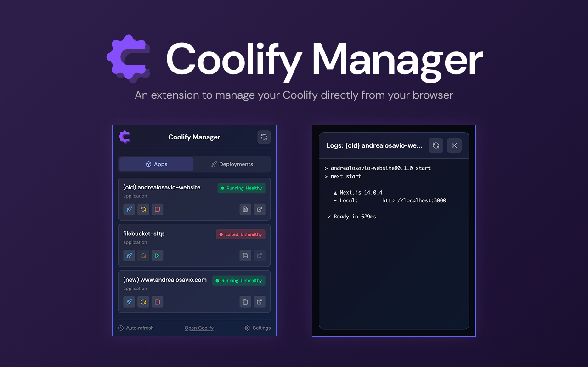

<p align="center">
  
</p>

<h1 align="center">Coolify Manager</h1>

<p align="center">
  A Chrome extension to manage your <a href="https://coolify.io/">Coolify</a> applications directly from your browser.
</p>

<p align="center">
  
 
  
</p>

<p align="center">
  
</p>

## Highlights

- Real-time overview of every Coolify application with status, FQDN, and repository metadata.
- One-click controls for start, stop, restart, deploy, and log streaming.
- Deployment history with commit details, runtime status, and quick drill-down.
- Secure storage for server URL and API token via Chrome's sync storage.

## Quick Start

### From Chrome Web Store

_(wait for approval)_

### From Source (Developer Mode)

1. Clone this repository:
   ```bash
   git clone https://github.com/ontech7/coolify-manager-extension.git
   ```
2. Open Chrome and navigate to `chrome://extensions/`
3. Enable **Developer mode** (toggle in the top right corner)
4. Click **Load unpacked** and select the cloned folder

## Configure Your Server

1. Enable API Access in Coolify (Settings → Advanced → API Access).
2. Create an API token with `read`, `write`, and `deploy` permissions.
3. In the extension, open Settings, enter the server URL (https://coolify.example.com), paste the token, test the connection, and save.

## License & Credits

MIT License. See [LICENSE](LICENSE).

Built by Andrea Losavio • [LinkedIn](https://www.linkedin.com/in/andrea-losavio/) – [Website](https://andrealosavio.com)

## Acknowledgments

- [Coolify](https://coolify.io/) - The amazing self-hostable Heroku/Netlify alternative
- [Lucide](https://lucide.dev/) - Open-source library for icons

---

Made with ❤️ for the Coolify community
